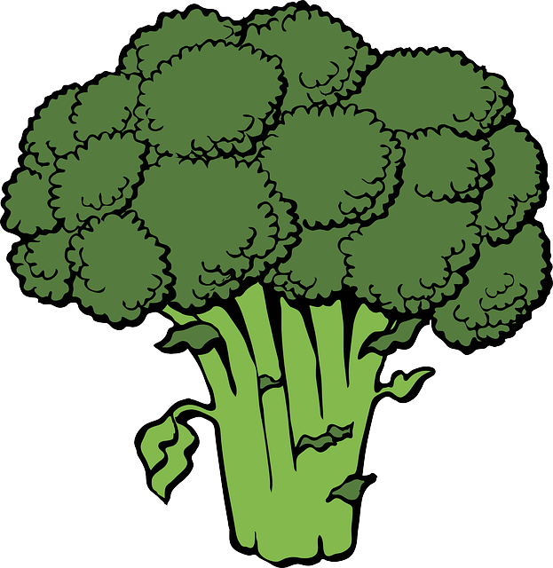
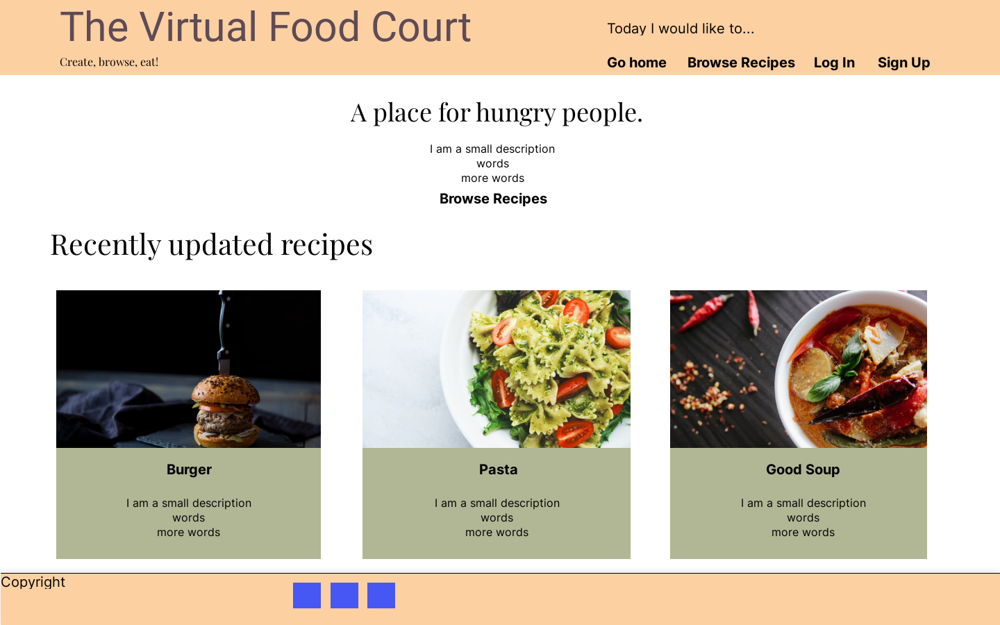
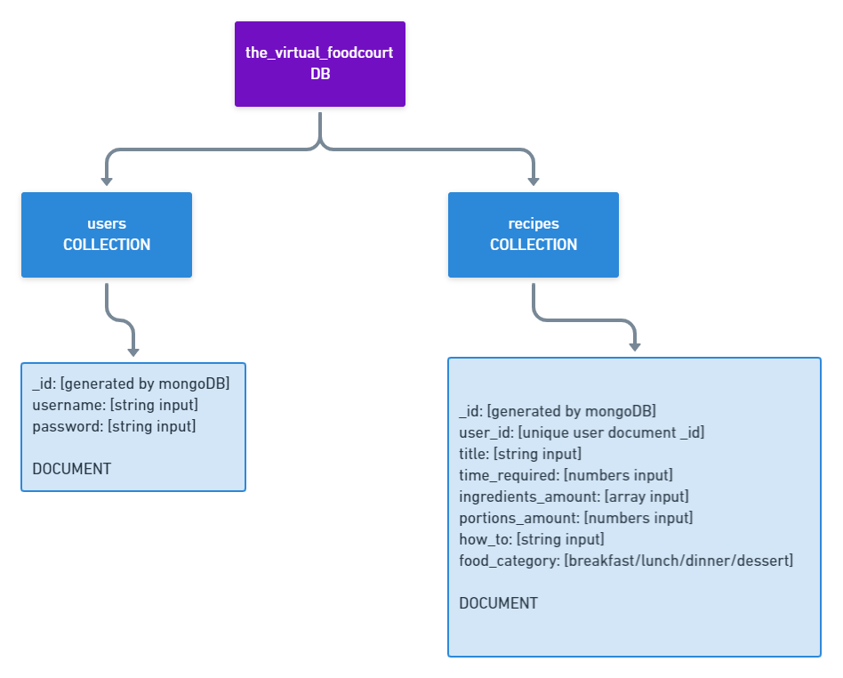
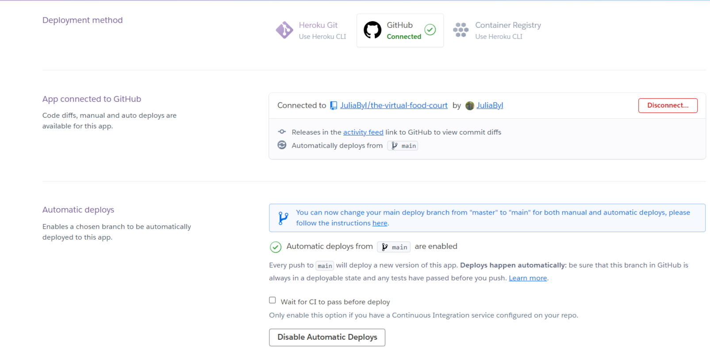

<!-- PROJECT LOGO -->
 

  

<h3 align="center">The Virtual Food Court</h3>

  

    A page created for easy creation and browsing of recipes. 
     
    <a href="#"><strong>Go to Website (to be added)</strong></a>
     
     
    <a href="https://github.com/JuliaByl">My Github Page</a>
    .
    <a href="https://www.linkedin.com/in/julia-bylund-12a027201/">LinkedIn</a>
    .
    <a href="#contact">Contact Details</a>
  

<!-- TABLE OF CONTENTS -->

  
Table of Contents

  <ol>
    <li>
      <a href="#about-the-project">About The Project</a>
      <ul>
        <li>
          <a href="#page-features">Page Features</a>
          <ul>
            <li><a href="#complete-wireframes">Complete Wireframes</a></li>
            <li><a href="#use-cases-flowchart">Use Cases Flowchart</a></li>
            <li><a href="#database-structure">Database Structure</a></li>
          </ul>
        </li>
        <li><a href="#built-with">Built With</a></li>
      </ul>
    </li>
    <li>
        <a href="#usage">Usage</a>
        <ul>
            <li><a href="#user-stories">User Stories</a></li>
        </ul>
    </li>
    <li>
        <a href="#roadmap">Roadmap</a>
        <ul>
            <li><a href="#deployment">Deployment</a></li>
            <li><a href="#bugs">Bugs</a></li>
            <li><a href="#rough-timeline-for-creating-website">Rough Timeline For Creating Website</a></li>
            <li><a href="#site-changes">Site Changes</a></li>
            <li>
                <a href="#testing">Testing</a>
                <ul>
                    <li><a href="#testing-user-stories">Testing User Stories</a></li>
                    <li><a href="#testing-the-code">Testing The Code</a></li>
                </ul>
            </li>
        </ul>
    </li>
    <li><a href="#license">License</a></li>
    <li><a href="#contact">Contact</a></li>
    <li>
      <a href="#acknowledgments">Acknowledgments</a>
      <ul>
        <li><a href="#readme">README</a></li>
        <li><a href="#website">Website</a></li>
      </ul>
    </li>
  </ol>

<!-- ABOUT THE PROJECT -->
## About The Project

This is a pretty straightforward recipe page aiming at providing an easy and motivating space to create and browse recipes.
Many of the features are based on what I personally like in a recipe page, since as a food lover, I look for recipes online regularly. I have also gotten input from colleagues and friends on what they think is important when browsing a recipe page.
Features inspired directly from specific pages will be added under acknowledgements, with a link to the page.

### Page Features
 

[Page features in a table view](https://github.com/JuliaByl/the-virtual-food-court/blob/main/documentation/for_readme_pdf/page_features_table.pdf)

#### Complete Wireframes
 

* [Big and medium screen wireframes (pdf)](https://github.com/JuliaByl/the-virtual-food-court/blob/main/documentation/for_readme_pdf/big_screen_wireframes.pdf)
* [Small screen wireframes (pdf)](https://github.com/JuliaByl/the-virtual-food-court/blob/main/documentation/for_readme_pdf/small_screen_wireframes.pdf)

#### Use Cases Flowchart
 

#### Database Structure
 

This has been updated from the original database structure, since I realised there were some easier ways to get things from the database. Instead of having the food types separately as keys with the values of "on/off" (ex. "breakfast": on), I am adding a single key (food_category) which will have the value of each food type item that gets picked when creating the recipe. To see my old structure, [here is the link](https://github.com/JuliaByl/the-virtual-food-court/blob/main/documentation/for_readme_images/database_overview_v1.png). I also added a "title" key for the simple reason that I missed adding it originally, but it was already planned into the page structure.
 

(<a href="#top">back to top</a>)

### Built With
 

* [HTML5](https://en.wikipedia.org/wiki/HTML5)
* [CSS](https://en.wikipedia.org/wiki/CSS)
* [JavaScript](https://www.javascript.com/)
* [jQuery](https://jquery.com/)
* [Python](https://www.python.org/)
* [Flask](https://flask.palletsprojects.com/en/2.0.x/)
* [MongoDB](https://www.mongodb.com/)
* [Bootstrap](https://getbootstrap.com/)
* [Gitpod](https://gitpod.io/)
* [Github](https://github.com/)
* [Google Fonts](https://fonts.google.com/?query=arvo)

(<a href="#top">back to top</a>)

<!-- USAGE -->
## Usage

### User stories
 

As a *non-logged in* user I want to:

* Upon entering the page, clearly locate all my options as to what I can achieve on the website (browse recipes, register to create, edit and delete my own recipes) 
    - *by having a simplistic and clear design focusing on UX and CRUD*
* Feel excited to use the recipes found on the website 
    - *by having a good template for showcasing recipes that is easy to read and understand, with interesting images to draw people in*
* Have many options to choose between for every mood and meal 
    - *by having categories for different meals such as breakfast, lunch, dinner and dessert*

As a *logged in* user I want to:

* Upon logging in, find what I can do as a registered user of the page 
    - *by having the new options displayed clearly on the home page and in the menu*
* Create, edit and delete my own recipes with ease 
    - *by having a clear and simple submit form with instructions that makes sense to everyone*
* Have the option to end my membership 
    - *by having a button displayed in a corner as to not click on it by accident*

(<a href="#top">back to top</a>)

<!-- ROADMAP -->
## Roadmap

### Deployment

The site was deployed to Heroku. Below is a list of the steps I took to get my page up and running.

1. I installed the dependencies needed for the project, and saved them in a requirements.txt file.
2. I created a Procfile to let Heroku know which file to run. I used the command: echo web: python app.py.
3. Logged in to Heroku and created my new app. The exact name I wanted to use for the app was available (the-local-food-court).
4. Since I am based in Europe, I chose EU for region.
5. I chose automatic deployment for this project, by going to the deploy tab in Heroku, picking GitHub for the deployment, and chosing my project repository before clicking on "connect".
6. Next step was to go to settings > "reveal config vars" and added the varables listed in my env.py file.
7. Enable automatic Deployment.
8. All done!
 

### Bugs

[Link to Github issues section](https://github.com/JuliaByl/the-virtual-food-court/issues)

### Rough Timeline For Creating Website
 
<!--:white_check_mark: to be used when finishing a task-->

1. Create the database :white_check_mark:
2. Start on the base html for header, footer and other repeatable elements :white_check_mark:
3. Create the rest of the front end content (not being too focused on details) :white_check_mark:
4. Create *browse recipes/ view recipe* function :white_check_mark:
5. Create *register/log in/log out/delete account* features :white_check_mark:
6. Create *add/ edit/ delete recipe* :white_check_mark:	
7. Fine-tune :white_large_square:	
9. Testing :white_large_square:	
10. Deploy website :white_check_mark:	

### Site Changes
 

* After having a talk with my mentor, I decided to change the layout of the how-to section in view-recipe.html slightly. Instead of having one big block of text with no breathing room, I now have list items separated with some room in between each other.
In MongoDB the how-to attribute changed from a string to an array. This will also change the layout of the create-recipe page, since I will have to cater for the list items. I will make the input for the how-to section the same as for the ingredients input.

* I decided to remove the "clear recipe" - button in create-recipe.html since it is possible to remove the contents of the form manually and I wanted to make sure I had enough time to have good quality code for the more essential functions that would "make or break" the page.

* The columns in the create-recipe.html form was originally meant to be 3 horizontally aligned medium and bigger screen sizes. (See layout in my wireframes). But once it was created and I tested adding information to the forms, I saw that it looked too messy and decided to change the layout to max. 2 columns aligned horizontally. The how-to textarea needed a full col-12 (Bootstrap) since it generally gets more text than the other inputs.

* In the recipe preview cards I added additional information to the header. So instead of just a title and a preview of the recipe how-to section, the user can also see portions and time required. In my wireframes I added images as part of the cards too, but due to lack of time, I will unfortunately have to drop that. 

### Testing
 

* to be added later in the project

#### Testing User Stories
 

* to be added later in the project

#### Testing The Code
 

* [link to testing doc](#)

(<a href="#top">back to top</a>)

<!-- LICENSE -->
## License

Distributed under the MIT License. See `LICENSE.txt` for more information.

(<a href="#top">back to top</a>)

<!-- CONTACT -->
## Contact

Send me an [email](mailto:julia.bylund.97@gmail.com)
 
Or contact me on [LinkedIn](https://www.linkedin.com/in/julia-bylund-12a027201/)
 
Want to browse my other projects on [GitHub](https://github.com/JuliaByl)?

(<a href="#top">back to top</a>)

<!-- ACKNOWLEDGMENTS -->
## Acknowledgments

### README
 

* [GitHub Docs](https://docs.github.com/en)
* [README template from othneildrew](https://github.com/othneildrew/Best-README-Template)
* [Markdown Guide for customising README](https://www.markdownguide.org/)
* [Cheat sheet for emojis](https://github.com/ikatyang/emoji-cheat-sheet#symbols)

### Website
 

* [Logo from clker-free-vector-images on Pixabay](https://pixabay.com/users/clker-free-vector-images-3736/?utm_source=link-attribution&amp;utm_medium=referral&amp;utm_campaign=image&amp;utm_content=40295) #
* [cdnjs](https://cdnjs.com/)
* [Stack Overflow](https://stackoverflow.com/)
* [W3 Schools](https://www.w3schools.com/)
* [Geeks for Geeks](https://www.geeksforgeeks.org/)
* [Flask official documentation](https://flask.palletsprojects.com/en/2.0.x/)
* [Jinja official documentation](https://jinja.palletsprojects.com/en/3.0.x/)
* [Python official documentation](https://www.python.org/)
* [jQuery official documentation](https://jquery.com/)
* [Bootstrap](https://getbootstrap.com/)
* [Code institute mini project](https://github.com/Code-Institute-Solutions/TaskManagerAuth)
* [W3C markup validation service](https://validator.w3.org/)
* [W3C CSS validatoion service](https://jigsaw.w3.org/css-validator/)
* [JSHint](https://jshint.com/)
* [pep8online](http://pep8online.com/)
* [WAVE web accesibility evaluation tool](https://wave.webaim.org/)
* [Google Fonts](https://fonts.google.com/?query=arvo)

(<a href="#top">back to top</a>)

