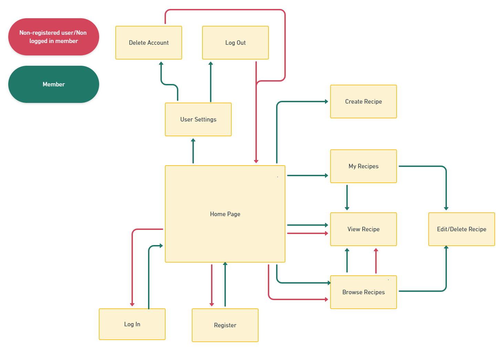

<!-- PROJECT LOGO -->
 

  

<h3 align="center">The Virtual Food Court</h3>

  

    A page created for easy creation and browsing of recipes. 
     
    <a href="#"><strong>Go to Website (to be added)</strong></a>
     
     
    <a href="https://github.com/JuliaByl">My Github Page</a>
    .
    <a href="https://www.linkedin.com/in/julia-bylund-12a027201/">LinkedIn</a>
    .
    <a href="#contact">Contact Details</a>
  

<!-- TABLE OF CONTENTS -->

  
Table of Contents

  <ol>
    <li>
      <a href="#about-the-project">About The Project</a>
      <ul>
        <li>
          <a href="#page-features">Page Features</a>
          <ul>
            <li><a href="#complete-wireframes">Complete Wireframes</a></li>
          </ul>
          <ul>
            <li><a href="#use-cases-flowchart">Use Cases Flowchart</a></li>
          </ul>
          <ul>
            <li><a href="#database-structure">Database Structure</a></li>
          </ul>
        </li>
      </ul>
      <ul>
        <li><a href="#built-with">Built With</a></li>
      </ul>
    </li>
    <li>
        <a href="#usage">Usage</a>
        <ul>
            <li><a href="#user-stories">User Stories</a></li>
        </ul>
    </li>
    <li>
        <a href="#roadmap">Roadmap</a>
        <ul>
            <li><a href="#bugs">Bugs</a></li>
        </ul>
        <ul>
            <li><a href="#rough-timeline-for-creating-website">Rough Timeline For Creating Website</a></li>
        </ul>
        <ul>
            <li>
                <a href="#testing">Testing</a>
                <ul>
                    <li><a href="#testing-user-stories">Testing User Stories</a></li>
                </ul>
                <ul>
                    <li><a href="#testing-the-code">Testing The Code</a></li>
                </ul>
            </li>
        </ul>
    </li>
    <li><a href="#contributing">Contributing</a></li>
    <li><a href="#license">License</a></li>
    <li><a href="#contact">Contact</a></li>
    <li>
      <a href="#acknowledgments">Acknowledgments</a>
      <ul>
        <li><a href="#readme">README</a></li>
      </ul>
      <ul>
        <li><a href="#website">Website</a></li>
      </ul>
    </li>
  </ol>

<!-- ABOUT THE PROJECT -->
## About The Project

This is a pretty straightforward recipe page aiming at providing an easy and motivating space to create and browse recipes.
Many of the features are based on what I personally like in a recipe page, since as a food lover, I look for recipes online regularly. I have also gotten input from colleagues and friends on what they think is important when browsing a recipe page.
Features inspired directly from specific pages will be added under acknowledgements, with a link to the page.

### Page Features
 

[Page features in a table view](https://github.com/JuliaByl/the-virtual-food-court/blob/master/documentation/for_readme_pdf/page_features_table.pdf)

#### Complete Wireframes
 

* [Big and medium screen wireframes (pdf)](https://github.com/JuliaByl/the-virtual-food-court/blob/master/documentation/for_readme_pdf/big_screen_wireframes.pdf)
* [Small screen wireframes (pdf)](https://github.com/JuliaByl/the-virtual-food-court/blob/master/documentation/for_readme_pdf/small_screen_wireframes.pdf)

#### Use Cases Flowchart
 

#### Database Structure
 

(<a href="#top">back to top</a>)

### Built With
 

* [HTML5](https://en.wikipedia.org/wiki/HTML5)
* [CSS](https://en.wikipedia.org/wiki/CSS)
* [JavaScript](https://www.javascript.com/)
* [jQuery](https://jquery.com/)
* [Python](https://www.python.org/)
* [Flask](https://flask.palletsprojects.com/en/2.0.x/)
* [MongoDB](https://www.mongodb.com/)
* [Bootstrap](https://getbootstrap.com/)

(<a href="#top">back to top</a>)

<!-- USAGE -->
## Usage

### User stories
 

As a *non-logged in* user I want to:

* Upon entering the page, clearly locate all my options as to what I can achieve on the website (browse recipes, register to create, edit and delete my own recipes) 
    - *by having a simplistic and clear design focusing on UX and CRUD*
* Feel excited to use the recipes found on the website 
    - *by having a good template for showcasing recipes that is easy to read and understand, with interesting images to draw people in*
* Have many options to choose between for every mood and meal 
    - *by having categories for different meals such as breakfast, lunch, dinner and dessert*

As a *logged in* user I want to:

* Upon logging in, find what I can do as a registered user of the page 
    - *by having the new options displayed clearly on the home page and in the menu*
* Create, edit and delete my own recipes with ease 
    - *by having a clear and simple submit form with instructions that makes sense to everyone*
* Have the option to end my membership 
    - *by having a button displayed in a corner as to not click on it by accident*

(<a href="#top">back to top</a>)

<!-- ROADMAP -->
## Roadmap

### Bugs

[Link to Github issues section](https://github.com/JuliaByl/the-virtual-food-court/issues)

### Rough Timeline For Creating Website
 
<!--:white_check_mark: to be used when finishing a task-->

1. Create the database :white_large_square:	
2. Start on the base html for header, footer and other repeatable elements :white_large_square:	
3. Create the rest of the front end content (not being too focused on details) :white_large_square:	
4. Create *register/log in/log out/delete account* features :white_large_square:	
5. Create *add/ edit/ delete recipe* :white_large_square:	
6. Create *browse recipes* function :white_large_square:	
7. Fine-tune :white_large_square:	
8. Testing :white_large_square:	
9. Deploy website :white_large_square:	

### Testing
 

* to be added later in the project

#### Testing User Stories
 

* to be added later in the project

#### Testing The Code
 

* to be added later in the project

(<a href="#top">back to top</a>)

<!-- LICENSE -->
## License

Distributed under the MIT License. See `LICENSE.txt` for more information.

(<a href="#top">back to top</a>)

<!-- CONTACT -->
## Contact

Send me an [email](mailto:julia.bylund.97@gmail.com)
 
Or contact me on [LinkedIn](https://www.linkedin.com/in/julia-bylund-12a027201/)
 
Want to browse my other projects on [GitHub](https://github.com/JuliaByl)?

(<a href="#top">back to top</a>)

<!-- ACKNOWLEDGMENTS -->
## Acknowledgments

### README
 

* [GitHub Docs](https://docs.github.com/en)
* [README template from othneildrew](https://github.com/othneildrew/Best-README-Template)
* [Markdown Guide for customising README](https://www.markdownguide.org/)
* [Cheat sheet for emojis](https://github.com/ikatyang/emoji-cheat-sheet#symbols)

### Website
 

* [Logo from clker-free-vector-images on Pixabay](https://pixabay.com/users/clker-free-vector-images-3736/?utm_source=link-attribution&amp;utm_medium=referral&amp;utm_campaign=image&amp;utm_content=40295) 

(<a href="#top">back to top</a>)

